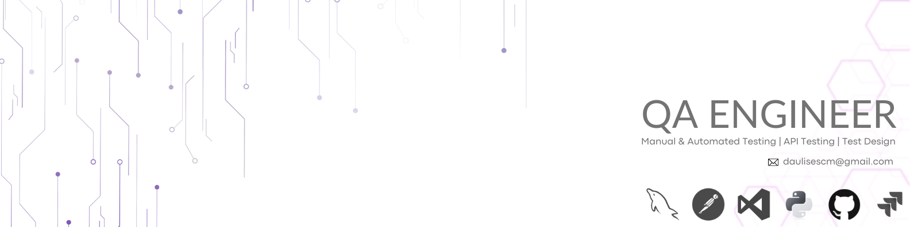

<!-- Banner -->

  

<h1 align="center">QA Engineer</h1>

  Manual &amp; Automated Testing | API Testing | Test Design

<!-- Contact links -->

  
  
  

---

## Skills

  
  
  
  
  
  

  
  
  
  
  
  
  

---

## About
- 🔎 Focus: **Functional, Regression, and API Testing**
- 🧩 Test Design: **Equivalence Classes & Boundary Value Analysis**
- 🤖 Automation (Basic): **Selenium (Python)** and **Cypress
**
- 🧰 Tools: **Postman, Jira, Chrome DevTools, GitHub**

---

## Featured Projects
| Project | Focus | Key Deliverables |
|---|---|---|
| **[Urban Grocers – Test Design](https://github.com/daulises/urban-grocers-test-design)** | Test design & business rules | Test cases, structured documentation |
| **[Urban Routes – Equivalence Testing](https://github.com/daulises/urban-routes-equivalence-testing)** | Equivalence classes | Positive/negative scenarios, coverage |
| **[Urban Routes – Regression Testing](https://github.com/daulises/urban-routes-regression-testing)** | Regression validation | Stability checks after changes/fixes |
| **[Urban Routes – Car Sharing](https://github.com/daulises/urban-Routers-Car-Sharing)** | User flows validation | Functional scenarios & QA documentation |

---

## Resume
📄 **Download my resume:** [CV - Daniel Ulises Chávez Morales](assets/resume.pdf)

---

## Get in touch
- 💼 LinkedIn: https://www.linkedin.com/in/daniel-ulises-chavez-morales/  
- ✉️ Email: daulisescm@gmail.com  
- 👤 Facebook: https://www.facebook.com/Daulises

